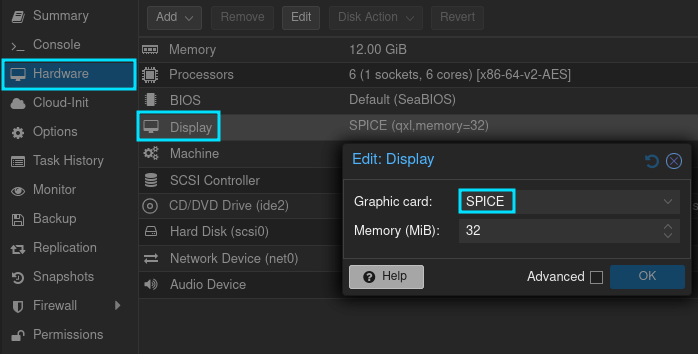
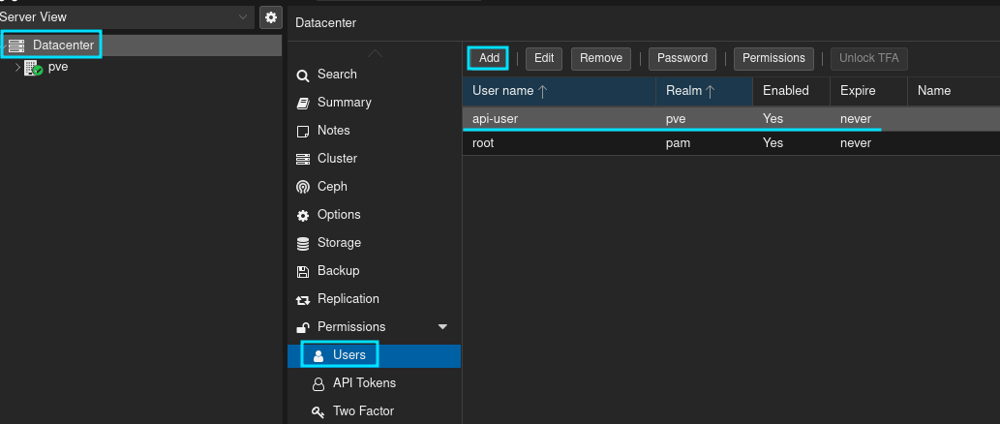
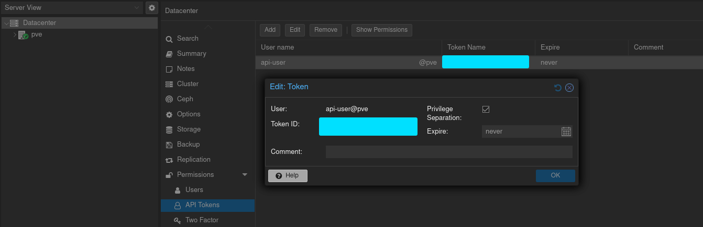
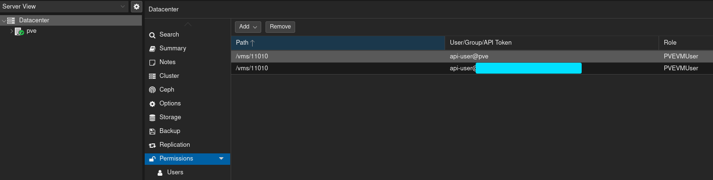
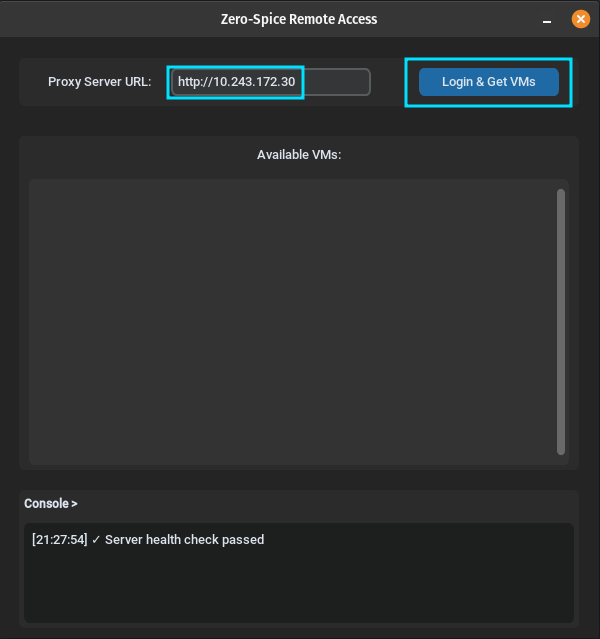
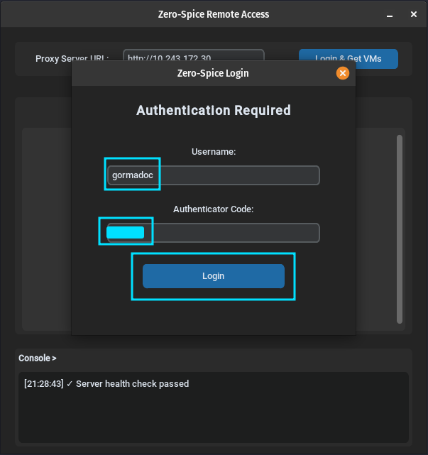
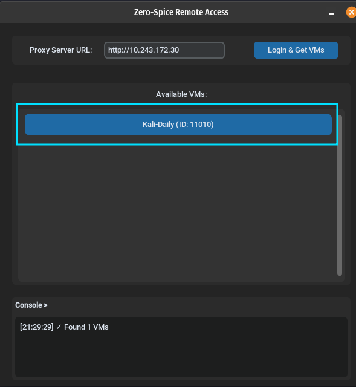

# ZeroSpice Installation Guide

ZeroSpice enables secure remote access to Proxmox VMs via SPICE protocol over a ZeroTier network. To achieve this, ZeroSpice uses a configured server and at least one configured client. This guide walks you through setting up both the server and client components.

## Architecture Overview
```
   Proxmox VE            ZeroSpice Server       ZeroSpice Client
┌───────────────┐       ┌───────────────┐       ┌───────────────┐
│ LAN Interface │       │ LAN Interface │       │ LAN Interface │
│  (Rest API)   │<------│(HTTP Request) │       │    (none)     │
│               │       │               │       │               │
│               │       │ ZT Interface  │       │ ZT Interface  │
│ (SPICE port)  │<----->│ (SPICE port)  │<----->│ (SPICE port)  │
│               │       │ (Rest API)    │<------│(HTTP Request) │
└───────────────┘       └───────────────┘       └───────────────┘
              (LAN Traffic)            (ZeroTier Traffic)
```

- **ZeroSpice Client**: Desktop application for connecting to VMs.
- **ZeroSpice Server**: Linux application for brokering SPICE sessions btweeen Proxmox and ZeroSpice Clients
- **Proxmox VE**: Proxmox virtual environment hypervisor

## Prerequisites

- **Client Requirements**:
  - Python 3.10+
  - ZeroTier application
  - virt-viewer application

- **Server Requirements**:
  - Linux (Ubuntu 20.04+ recommended)
  - Python 3.10+
  - ZeroTier application
  - Network access to Proxmox
      - ZeroSpice Server is intended to access Proxmox via a private LAN.
      - Ensure the ZeroSpice Server can access the Proxmox API and SPICE ports.
  - Network access to ZeroTier root servers
      - Standard internet access achieves this.
      - If you wish to run a more secure implementation, you can restrict internet access but allowlist ZeroTier's global root servers (https://docs.zerotier.com/whitelist/). However, this is not recommended for most users. Doing so will decrease the speed of ZeroTier connections by restricting the protocol's ability to broker more efficient routes between client(s) and the server.

- **Proxmox Requirements**:
  - Proxmox VE 7.0+
  - API access credentials
  - VMs configured with SPICE display

---

## Installation Steps

### Step 1: Enable SPICE on Proxmox VMs

Before using ZeroSpice, you need to enable SPICE display on the VMs you want to access remotely.

**Option A: Via Proxmox Web UI**

1. Select your VM in the Proxmox web interface
2. Go to **Hardware** tab
3. Double-click on **Display**
4. Change display type to **SPICE**
5. Click **OK** to save



**Option B: Via Command Line**
```bash
# Replace <vmid> with your VM ID
qm set <vmid> --vga qxl
```

**Verify SPICE is enabled:**
```bash
qm config <vmid> | grep vga
# Should output: vga: qxl
```

Repeat this process for all VMs you want to access via ZeroSpice.

---

### Step 2: Create Proxmox API User and Token

ZeroSpice needs API credentials to communicate with Proxmox.

#### 2.1 Create a User

1. Log into Proxmox web interface
2. Navigate to **Datacenter** → **Permissions** → **Users**
3. Click **Add** to create a new user:
   - **User name**: `zerospice` or whatever you want
   - **Realm**: Your provmox realm (default: `pve`)
   - **Expire**: Your preference, but never is fine
4. Click **Add**


*Note: This image creates a user with the name `api-user`. Name it whatever you want, just remember which you go with.*

#### 2.2 Create an API Token

1. Navigate to **Datacenter** → **Permissions** → **API Tokens**
2. Click **Add**
3. Configure the token:
   - **User**: `zerospice@pve`
   - **Token ID**: `zerospice-token`
   - **Privilege Separation**: Uncheck (or configure specific permissions)
4. Click **Add**
5. **IMPORTANT**: Copy the displayed token value - you won't be able to see it again!

The token format will look like: `zerospice@pve!zerospice-token=xxxxxxxx-xxxx-xxxx-xxxx-xxxxxxxxxxxx`



#### 2.3 Set Permissions

The API user needs permissions to access VM information.

**Option A: Via Proxmox Web Gui**

1. Navigate to **Datacenter** → **Permissions**
2. Add *user* permission
  - Path: Select the VM(s) you wish to access
  - User: Select your API user
  - Role: Select `PVEVMUser`

**Option B: Via Command Line**

```bash
# Grant permissions at datacenter level
pveum acl modify / -user zerospice@pve -role PVEVMUser
```

**Required permissions:**
- VM.Audit (view VM information)
- VM.Console (access SPICE console)


*Note: I created permissions for both the user and the user's API token. If one doesn't work for you, try the other.*

---

### Step 3: Install ZeroTier on Server

ZeroTier creates a secure network between your server and clients.

#### 3.1 Create a ZeroTier Network

1. Sign up at [https://my.zerotier.com](https://my.zerotier.com)
2. Create a new network
3. Note your **Network ID** (16-character hex string)
4. Configure network settings:
   - **Access Control**: Private (manual authorization)
   - **IPv4 Auto-Assign**: Enabled (or configure manually)

#### 3.2 Install ZeroTier on Server

The server installation script can install ZeroTier for you, or you can install it manually:

**Option A: Install via install.sh (recommended)**

The ZeroSpice Server installation script will prompt you to install ZeroTier - just follow the prompts.

**Option B: Manual Installation**
```bash
# Install ZeroTier
curl -s https://install.zerotier.com | sudo bash

# Join your network
sudo zerotier-cli join <your-network-id>

# Verify installation
sudo zerotier-cli info
sudo zerotier-cli listnetworks
```

#### 3.3 Authorize the Server

1. Go to [https://my.zerotier.com](https://my.zerotier.com)
2. Click on your network
3. Scroll to **Members** section
4. Find your server (identified by its address)
5. Check the **Auth** checkbox to authorize it
6. Note the **Managed IP** assigned to your server

---

### Step 4: Install ZeroSpice Server

Now install the ZeroSpice server software on your Linux server.

#### 4.1 Clone the Repository
```bash
# Clone the repository
git clone https://github.com/Jstith/ZeroSpice.git
cd ZeroSpice/Server
```

#### 4.2 Run Installation Script
```bash
# Make the script executable
chmod +x install.sh

# Run the installation script
sudo ./install.sh
```

#### 4.3 Configuration Prompts

The installation script will prompt you for the following information:

| Prompt | Description | Example |
|--------|-------------|---------|
| **Proxmox IP address** | IP address of your Proxmox host | `192.168.1.100` |
| **Proxmox API Token** | Full API token from Step 2 | `zerospice@pve!zerospice-token=xxx...` |
| **Proxy server IP** | ZeroTier IP of the server | `10.147.10.10` |
| **Proxy HTTP port** | Port for web interface | `80` (default) |
| **Proxy SPICE port** | Port for SPICE connections | `3128` (default) |

[IMAGE: Installation Script Running]

**Example:**
```
Please provide the following configuration values:

Proxmox IP address: 192.168.1.100
Proxmox API Token (format: user@realm!tokenid=uuid): zerospice@pve!zerospice-token=xxxxxxxx-xxxx-xxxx-xxxx-xxxxxxxxxxxx
Proxy server IP (usually ZeroTier IP): 10.147.10.10
Proxy HTTP port [8000]: 80
Proxy SPICE port [3128]: 3128

Generating JWT secret...
✓ .env file created successfully!
```

The script will:
- ✅ Check for ZeroTier (install if needed)
- ✅ Install system dependencies
- ✅ Create Python virtual environment
- ✅ Install Python packages
- ✅ Generate configuration file
- ✅ Create systemd service

---

### Step 5: Generate User Authentication Secrets

ZeroSpice uses Time-based One-Time Passwords (TOTP) for authentication. You need to generate a secret for each user.

#### 5.1 Generate TOTP Secret
```bash
# Generate secret for a user
./venv/bin/python3 src/setup_totp.py <username>
```

**Example:**
```bash
./venv/bin/python3 src/setup_totp.py alice

Generating TOTP secret for user: alice
Secret: JBSWY3DPEHPK3PXPJBSWY3DP
QR Code saved to: alice_qr.png

Add this line to your .env file:
TOTP_SECRET_ALICE=JBSWY3DPEHPK3PXPJBSWY3DP
```

*Note: You can use the QR code generated, or take the token and enter it directly to an app like authy.*

#### 5.2 Add Secret to Configuration

Edit the `.env` file and add the generated secret:
```bash
nano .env
```

Add the line provided by the script:
```bash
# TOTP Secrets
TOTP_SECRET_ALICE=JBSWY3DPEHPK3PXPJBSWY3DP
TOTP_SECRET_BOB=ANOTHER_SECRET_HERE
```

Save and exit (Ctrl+X, then Y, then Enter).

#### 5.3 Repeat for All Users

Generate secrets for each user who needs access:
```bash
./venv/bin/python3 src/setup_totp.py bob
./venv/bin/python3 src/setup_totp.py charlie
# ... etc
```

**Important:** Keep these secrets secure! Anyone with access to a TOTP secret can authenticate as that user.

---

### Step 6: Set Up User TOTP Authentication

Each user needs to set up TOTP on their device using an authenticator app.

#### 6.1 Choose an Authenticator App

Popular options:
- **Authy** (iOS, Android, Desktop) - Tested with Authy
- **Google Authenticator** (iOS, Android)
- **Microsoft Authenticator** (iOS, Android)
- **1Password** (with TOTP support)

#### 6.2 Scan QR Code

1. Open your authenticator app
2. Select "Add Account" or "Scan QR Code"
3. Scan the QR code generated in Step 5
4. The app will display a 6-digit code that changes every 30 seconds

#### 6.3 Verify TOTP Setup

Test that the TOTP is working:
```bash
# Start the server temporarily to test
./venv/bin/python3 src/run.py
```

Try logging in with:
- **Username**: The name you used (e.g., `alice`)
- **TOTP Code**: 6-digit code from your authenticator app

---

### Step 7: Start ZeroSpice Server

Now that everything is configured, start the ZeroSpice server service.

#### 7.1 Enable and Start Service
```bash
# Enable service to start on boot
sudo systemctl enable zerospice

# Start the service
sudo systemctl start zerospice

# Check status
sudo systemctl status zerospice
```

**Expected output:**
```
● zerospice.service - ZeroSpice Server
     Loaded: loaded (/etc/systemd/system/zerospice.service; enabled)
     Active: active (running) since Mon 2024-01-15 10:30:00 UTC; 5s ago
   Main PID: 12345 (python3)
      Tasks: 3 (limit: 4915)
     Memory: 45.2M
        CPU: 1.234s
     CGroup: /system.slice/zerospice.service
             └─12345 /path/to/venv/bin/python3 src/run.py
```

#### 7.2 View Logs
```bash
# View real-time logs
sudo journalctl -u zerospice -f

# View recent logs
sudo journalctl -u zerospice -n 50
```

#### 7.3 Verify Server is Running

Test the server is accessible:
```bash
# From the server itself
curl http://localhost/health

# From another machine on the ZeroTier network
curl http://<zerotier-ip>/health
```

---

### Step 8: Install and Run Client Application

Finally, install the ZeroSpice client application on the machines that will connect to VMs.

#### 8.1 Install ZeroTier on Client

1. Download ZeroTier from [https://www.zerotier.com/download/](https://www.zerotier.com/download/)
2. Install the application
3. Join your ZeroTier network:
   - **Windows/Mac**: Use the ZeroTier GUI
   - **Linux**: `sudo zerotier-cli join <network-id>`
4. Authorize the client in ZeroTier Central (same as Step 3.3)

#### 8.2 Download ZeroSpice Client

[Link to client download or repository]
```bash
# Example for Linux
git clone https://github.com/Jstith/ZeroSpice.git
cd ZeroSpice/Client
pip install -r requirements.txt
```

#### 8.3 Connect to a VM

1. Launch the ZeroSpice client application
2. Enter connection details:
   - **Server Address**: `http://<server-zerotier-ip>`
   - **Username**: Your username (e.g., `alice`)
   - **TOTP Code**: Current 6-digit code from authenticator
3. Select a VM from the list
4. Click **Connect**







---

## Verification Checklist

Before considering your installation complete, verify:

- SPICE is enabled on target Proxmox VMs
- Proxmox API token works and has correct permissions
- ZeroTier is installed and authorized on server
- ZeroSpice server is running (`systemctl status zerospice`)
- Server is accessible via ZeroTier IP
- TOTP secrets are generated for all users
- Users can authenticate with TOTP codes
- ZeroTier is installed and authorized on client
- Client can reach server via ZeroTier network
- Client can successfully connect to a VM

---

## Troubleshooting

### Server Won't Start
```bash
# Check logs for errors
sudo journalctl -u zerospice -n 100

# Check if ports are available
sudo netstat -tulpn | grep -E '8000|3128'

# Verify .env file is correct
cat .env
```

### Cannot Connect to Server from Client
```bash
# Verify ZeroTier connectivity
ping <server-zerotier-ip>

# Check if server ports are listening
nc -zv <server-zerotier-ip> 8000

# Check firewall rules (if applicable)
sudo ufw status
```

### TOTP Authentication Fails

- Verify time synchronization on both server and client (TOTP requires accurate time)
- Check that the TOTP secret in `.env` matches what's in the authenticator app
- Ensure username matches exactly (case-sensitive)

### VM Connection Issues

- Verify SPICE is enabled on the VM
- Check Proxmox API token has correct permissions
- Ensure VM is running
- Check Proxmox firewall settings
