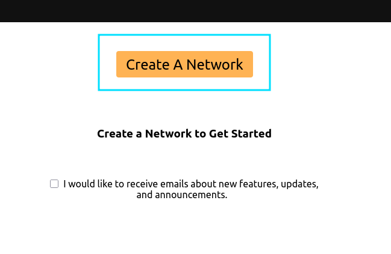
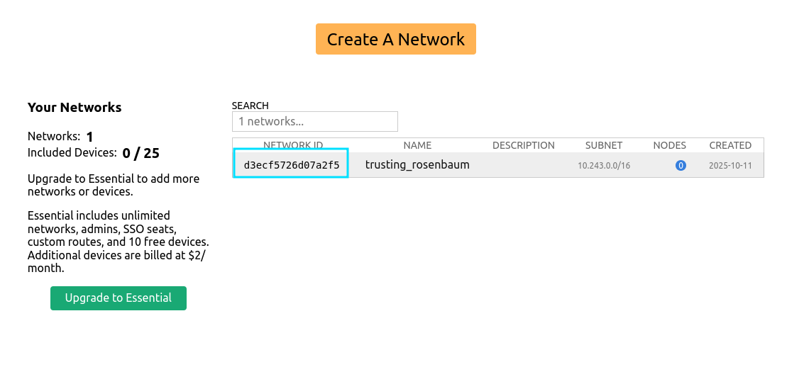
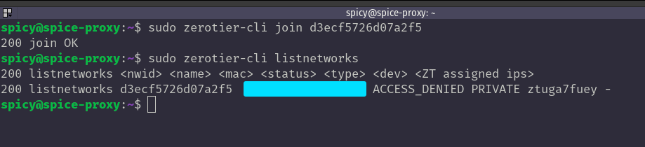
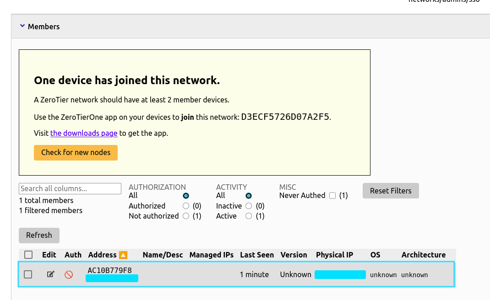
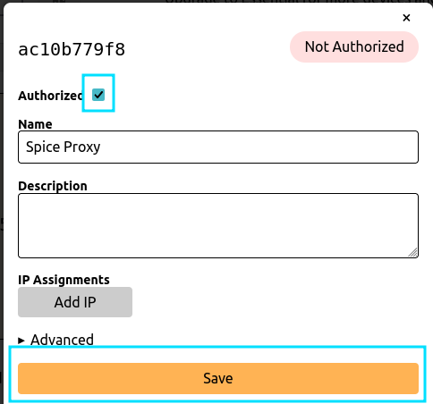
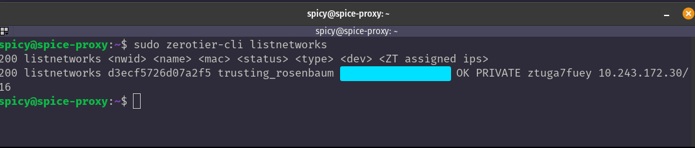
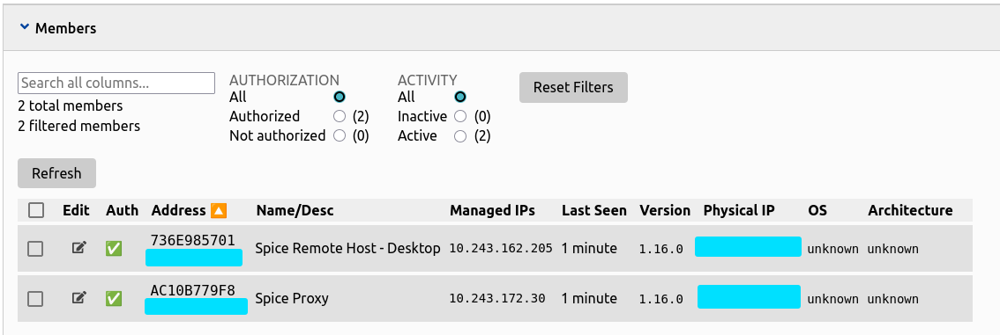
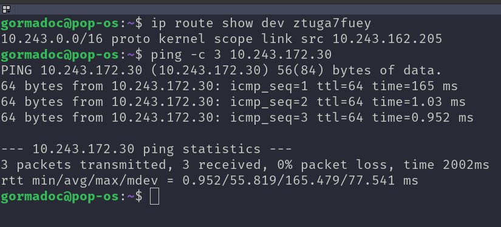

# Configuring Zerotier

Due to the nature of ZeroTier and the available SDKs, there's an easy button and a hard button for the initial network buildout, neither of which are entirely "zero config". My `Galaxy C2` project covers a bit more of the "hard button" with semi-automating agent deployment, but this project will use the easier option. In summary, you will need to create a ZeroTier network and manually join your remote client and proxy server.

## Making a Free ZeroTier Network

Go to `my.zerotier.com`, and sign up/sign in for a free account. Then, create a new network.



Once you've created the network, take note of the unique network ID (NWID).



### Add the proxy to ZeroTier

On your spice proxy, follow the instructions at https://www.zerotier.com/download to install the `zerotier-one` client on the machine. At the time of writing (October 2025), this can be achieved with:

```bash
curl -s 'https://raw.githubusercontent.com/zerotier/ZeroTierOne/main/doc/contact%40zerotier.com.gpg' | gpg --import && if z=$(curl -s 'https://install.zerotier.com/' | gpg); then echo "$z" | sudo bash; fi
```

When the installation finishes, you'll see your machine's new ZeroTier address. You can use this address to confirm you are authorizing the correct node later on. Next, you will tell your ZeroTier node to join the network you created by using:

```bash
sudo zerotier-cli join {ZeroTier Network ID}
```

You should see a success message. *Note: Ensure you are using the network ID you generated, not the machine ID generated by the local installer.*

However, your new node is not yet authorized on the network. You can confirm this by running `sudo zerotier-cli listnetworks` and seeing `ACCESS_DENIED`:



To authorize the node, you will go back to your network settings on `zerotier.com` and refresh the page. You should see a message saying a device has joined the network.



To authorize the node, click `edit` on the line item, check the `authorized` box, optionally name the node, and click `save`.



Now, the node is authorized and able to talk on the ZeroTier network. You can confirm this by running `sudo zerotier-cli listnetworks` again on the proxy and seeing `OK`.



### Add the Remote Host to ZeroTier

Finally, you will repeat the above steps to add your remote host to the ZeroTier network. Follow the installation instructions at https://www.zerotier.com/download, join the network using your unique network ID, and authorize the client in the web interface.

Once you have completed these steps, you should see two hosts on your ZeroTier network, one for the remote host and one for the spice proxy.



### Confirm Connection Between Proxy and Remote Host

Finally, check that you can ping between the remote host and the proxy using their ZeroTier IP addresses. Note: the zerotier interface will begin with `zt*`.



If you have issues pinging, check out the ZeroTier docs for troubleshooting connection. *Note: Double check you have authorized both nodes after joining them to the network.*

https://docs.zerotier.com/troubleshooting

If you can ping between the two hosts, your devices are configured and you are ready to move on!
